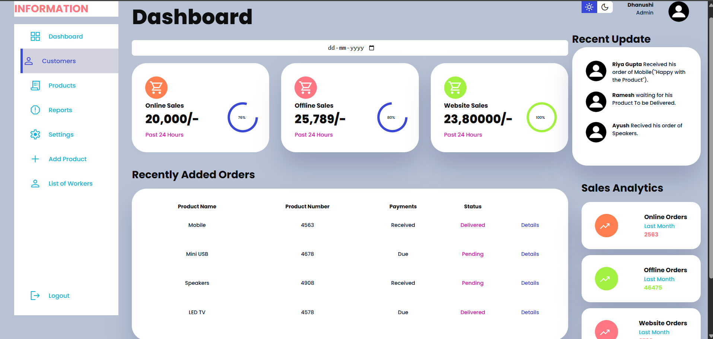

# 📊 Custom Admin Dashboard

A fully responsive and interactive **Admin Dashboard** built using modern web technologies to streamline product management, monitor sales performance, and provide real-time updates. This dashboard is ideal for internal business operations, allowing admins to manage products, customers, sales analytics, and user updates all in one place.

---

## 🚀 Project Description

The **Custom Admin Dashboard** is designed to give a real-time overview of key business metrics and operations. It features various modules such as customer details, order tracking, product lists, and worker management. The interface is intuitive, user-friendly, and responsive, with support for light and dark modes.

---

## 🎯 Project Objective

- To create a centralized interface for monitoring and managing product sales and user activity.
- To provide real-time analytics on online, offline, and website sales.
- To simplify product and order tracking for admins.
- To enhance user experience with visual components and interactive charts.
- To allow easy scalability and future integration with backend databases or APIs.

---

## 🛠️ Features

- ✅ Dashboard with online, offline, and website sales KPIs
- ✅ Recent order and product activity list
- ✅ User update feed (real-time order feedback)
- ✅ Sales analytics and insights
- ✅ Light/Dark mode toggle
- ✅ Sidebar navigation (Dashboard, Customers, Products, Reports, Settings, etc.)
- ✅ Date selector for filtering reports
- ✅ Admin user profile section
- ✅ Add products and manage workers

---

## 🖼️ Preview

---

## 💻 Technologies Used

- **Frontend:** HTML5, CSS3, JavaScript
- **Framework/Library:** React.js
- **Styling:** Tailwind CSS / CSS Modules
- **Charts:** Chart.js or Recharts (for analytics)
- **Icons:** FontAwesome / React Icons
- **State Management:** React Context API or Redux (optional)
- **Deployment:** GitHub Pages / Vercel / Netlify (optional)

---

## 🔮 Future Enhancements

- ✅ Integrate backend with MongoDB or Firebase for dynamic data
- ✅ Add user authentication and role-based access control
- ✅ Export reports as PDF or Excel
- ✅ Add filter/search to table data
- ✅ Enable real-time updates with WebSockets

## 👩‍💻 Author

- Dhanushi

-- [LinkedIn](https://www.linkedin.com/in/dhanushi-gupta-b3b397215/)

